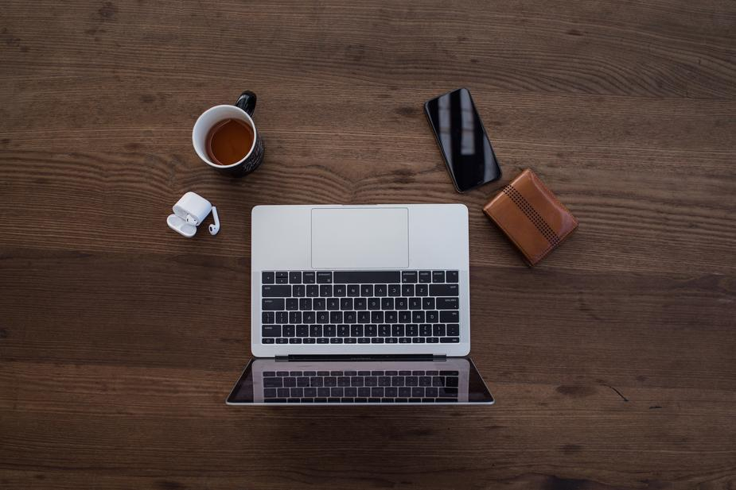
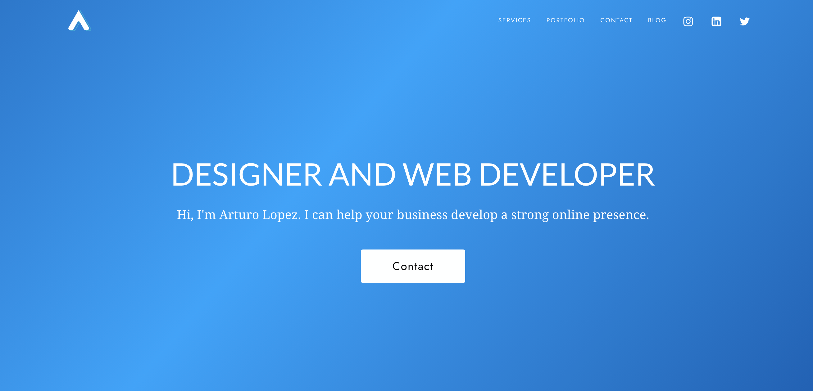

### Who This Article is For

Are you a small business who wants to launch their website and doesn't have the budget to hire a designer? Maybe you're an individual who wants to create a website for your personal brand, but doesn’t know how to code.

I wrote this article to help anyone who might not have web design experience, but wants to launch their own website.

There are many applications out there that help you create a website without any coding experience. Wix and Squarespace are among the most popular choices for people.

### What This Article Isn't
I will not be comparing Wix vs Squarespace. If you are interested in that, here is a good article I read online: 
<a href='https://www.websitetooltester.com/en/blog/wix-vs-squarespace/' target='_blank'>Wix vs Squarespace</a>

### Why Design Shouldn't be Overlooked

Design is crucial because it can be the difference between a happy customer and a frustrated one that leaves your page because they didn’t understand your website. You want to achieve the look and feel that you best represents your business brand while also delivering a great experience for the user.

### The Tips

<strong>The Hero</strong> is the first thing that someone sees on your website. It must tell the user who you are, what you do, and how you can bring value to them. Value can come in many different forms. It can be a service, product, entertainment, information - pretty much anything that the user is willing to give their attention to. You also want to make sure that you answer these in a simple way. People do not want to feel lost in your website, so my advice is always keep it clean and simple. Usually, I recommend going with a large font header, small font subheader that tells more, and main button(s).

On every section of your page, you should have a <strong>Call To Action</strong> (CTA). This can be a button, a link, etc. The CTA is what you want the user to do with the information you have given them. Sometimes, you can get away with having more than one CTA’s per section, as long as you are sure that they are relevant to the content shown in that section but I usually recommend keeping it to one or two.

Having a <strong>mobile design</strong> in today's day in age is pretty much non negotiable. I read somewhere that the nunmber of users browsing the internet on their phone is now around 50%. That means that if you don’t have a mobile design of your website, you could be missing out on 50% of your customers. Of course there are a number of things that you should account for when going mobile, but I'd say the one main thing is try to keep all the same info and content on mobile without crowding the screen.

Make sure you have a <strong>Simple Navigation</strong> at the top of your page. Most tools like Wix and squarespace help you with this, but just make sure that the link titles are not ambiguous.

Wherever possible apply these general design tips.
<ul>
<li>grab the user’s attention with an image or graphic</li>
<li>give them a short, but telling, header to pull them in</li>
<li>Have a subheader with information for them to learn more</li>
<li>follow with a Call To Action</li>
</ul>

### Final Comments

There is more to design than this. But these are some quick tips that I wish I knew when I made my first website.

Subscribe to get updates when there is a new post. Follow me on Social Media if you wish to stay connected.